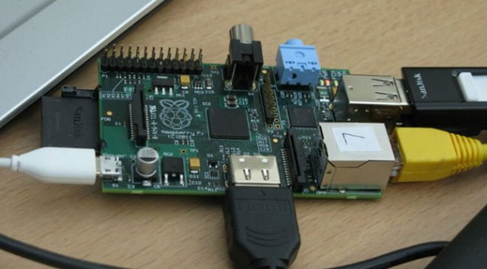
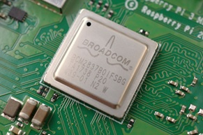
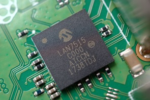
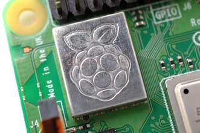
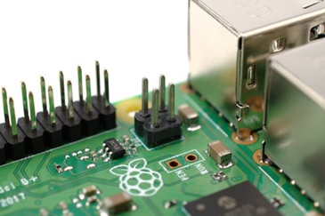
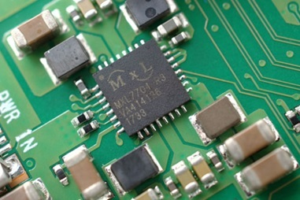

# Raspberry Pi mini računar
Raspberry Pi je mali, mini računar (veličine kreditne kartice) razvijen od strane [Raspberry Pi Fondacije](https://www.raspberrypi.org), britanske dobrotvorne organizacije, s namerom da učenicima i studentima ponudi jeftine računare i besplatan softver. Krajnji cilj je podsticanje obrazovanja na području kompjuterskih nauka. Delimo mišljenje da je Raspberi alat koji to omogućava. 
## Hardver
Na štampanoj pločici (PCB) nalaze se ulazni i izlazni konektori, kao i sam  hardver  računara. U početku, Fondacija je prodavala “golu” PCB . Konačna verzija će biti edukativno izdanje s primerima, dokumentacijom i unapred učitanim obrazovnim softverom. Na strani softvera, trenutno postoje tri operaciona sistema utemeljena na Linuxu koju podržava Raspberry Pi.

U prvoj proizvodnoj seriji proizvedeno je 10.000 komada B modela i sve su rasprodane u roku od nekoliko sati. Model B je verzija od 35 USD s najviše mogućnosti povezivanja, a to je model za koji je većina entuzijasta zainteresovana. Model A je bez Ethernet-a i sa jednim USB portom, za 25 USD. Dalje, završno edukaciono izdanje Raspberry Pi računara (s kućištem i dodacima) bilo je predviđeno  za leto 2012.
Danas (2019) aktuelna verzija, Rasperija objavljena pre oko 2 godine, poseduje sledeće hardverske komponente:
* 	Socket: Broadcom BCM2837B0 quad-core A53 (ARMv8) 64-bit @ 1.4GHz
*	GPU: Broadcom Videocore-IV
*	RAM: 1GB LPDDR2 SDRAM
*	Networking: Gigabit Ethernet (via USB channel), 2.4GHz and 5GHz 802.11b/g/n/ac Wi-Fi
*	Bluetooth: Bluetooth 4.2, Bluetooth Low Energy (BLE)
*	Storage: Micro-SD
*	GPIO: 40-pin GPIO header, populated
* Ports: HDMI, 3.5mm analogue audio-video jack, 4x USB 2.0, Ethernet, Camera Serial Interface (CSI), Display Serial Interface (DSI)
*	Dimensions: 82mm x 56mm x 19.5mm, 50g
U poređenju sa prethodnim verzijama Raspberry Pi 3B+ verzija poseduje:
* Brži  quadcore 1.4GHz CPU,

* 	Faster Ethernet (Gigabit via USB); novi  USB Ethernet kontroler nudi  gigabitnu konekciju, sa  teoretski  maksimalnim protokom od  300Mb/s, koristeći jedan  USB kanal.

* 	Dual-band 2.4GHz and 5GHz wireless LAN (Raspbian OS moramo updejtovati za korišćenje  radio- čipa)

* Power over Ethernet (PoE) ready dodatni PoE modul može biti dostupan posebno

* •	Naposletku, pametno integrisano  kolo za upravljanja energijom (PMIC) zamenjuje diskretne komponente i osigurava stabilno napajanje.

## O Rasperry Pi fondaciji
 Kako se na svom [sajtu predstavlja]((https://www.raspberrypi.org/about/)), Raspberi pi fondacija  „je dobrotvorna organizacija utemeljena u Velikoj Britaniji koja radi na tome da snagu računarstva i digitalno stvaranje stavi u ruke ljudi širom sveta. To činimo tako da više ljudi može iskoristiti snagu računarstva i digitalnih tehnologija za rad, rešiti probleme koji su im važni i kreativno se izraziti“.
 Dalje, kažu:
„Nudimo jeftine računare visokih performansi koje ljudi koriste za učenje, rešavanje problema i zabavu. Pružamo pomoć i edukaciju kako bismo pomogli većem broju ljudi da pristupe računarstvu i digitalnom stvaranju. Razvijamo besplatne resurse kako bismo pomogli ljudima da nauče o računarstvu i kako napraviti stvari pomoću računara, te osposobiti edukatore koji mogu   da uče druge ljude.“

Raspberry Pi Fondacijom  upravlja Upravni  Odbor  koji je odgovoran za efikasno  korišćenje resursa za postizanje  dobrotvornih ciljeva.
U 2015-oj godini prošireno je članstvo Fondacije. U budućnosti, članove Upravnog odbora biraće članovi Fondacije.
Članovi igraju važnu ulogu u pružanju podrške Upravnom odboru, doprinoseći strateškom smeru Fondacije...
Članstvo u Raspberry Pi Fondaciji  je dobrovoljno.

### Malo statistike
Do kraja  2018-e godine je, po Raspberry pi Fondaciji:
* 	Prodato je više od [23 miliona](https://blog.adafruit.com/2018/12/21/23-million-raspberry-pi-computers-sold-raspberry_pi-raspberrypi/)  Raspberry Pi računara.
*	Više od 250,000 mladih ljudi se svake nedelje  bavi u našim klubovima takmičenjima i programima.
*	Desetine hiljada mladih uče digitalne veštine kroz naše partnerstvo sa izviđačima, državnom službom građana i Evropskom svemirskom agencijom.
*	Mobilisano je više od 30.000  volontera.
*	50.000 nastavnika i volontera učestvovalo  je u online  kursevima.
*	Više od milion projekata završeno je na [web strani projekata](https://projects.raspberrypi.org/en/).

Većina  Rasperry Pi računara proizvodi se u Sony fabrici u  Pencoed-u, u  Velsu, u Velikoj Britaniji.  Određen broj se proizvodi u Kini i Japanu.

